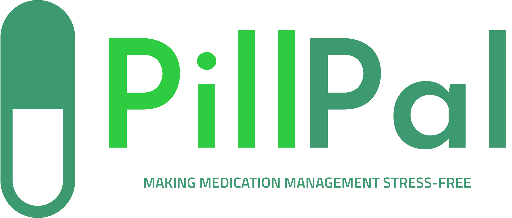

# PillPal

PillPal was initially inspired by Henry's father, a not so tech-savvy man with a dubious memory who has been a long-time culprit of fumbling his scheduled medication consumption. However, not long into the planning process, our team decided that PillPal could and should cater to a much broader range of Australians in the healthcare sector.

PillPal is a software designed to help nurses, age-care workers, and other carers to alleviate some of their stress within their high-pressure working environments. It does this by providing daily reminders of what drugs needs to be administered to which patients at what times. When reminders are overdue without having been checked off, PillPal will send the user a notification on their phone, reminding them to administer the drug.

As not all users are tech-savvy and many caretakers work in a fast-paced environment, we endeavoured to make the interface clean and intuitive. We employed strategic choices within our html, CSS, and Javascript to achieve our desired front-end. For the back-end, we used indexedDB and Javascript to store patient and drug data locally, protecting caretakers and their patients from network outages.

## Henry

My involvement in PillPal consisted primarily of creating the ‘backend’ functionality for the site.

I chose to implement the local storage mechanism through IndexedDB, which stores each prescription as an object with all its relevant details. I had never used IndexedDB, or any DBMS prior to the hackathon commencing. I toyed with the idea of using MongoDB, and pouchDB, as I had seen previous entrants use that, but ending up choosing IndexedDB as it comes installed into each browser and thus requires minimal overhead to set up and implement local storage, which is all that was required for this project.

I found it particularly challenging to navigate how to initialise and fill up the database, but made use of Mozilla’s documentation as a guide to the point where I am comfortable creating a database, adding data, reading data and updating data in it. 

Javascript was utilised as the backend language of choice due to the fact it interacts with IndexedDB, and one script could simulatneously interact with the Front End DOM and the backend DB. Prior to this hackathon I have only had small dealings with Javascript before, mainly dealing with things like DOM events and handling. This was a new challenge for me, but now I feel much more comfortable dealing with JS code. 

--- 

## Kaiyuan

My involvement consisted of project planning, front-end design, writing, and directing the pitch video.

Through PillPal, I gained valuable experience in the strategic designing of the front-end using html, CSS, and for the first time, Javascript. Some of my strategic design choices include the usage of a smart-casual looking rounded font, which gives off a comforting and non-confrontational vibe necessary to not increase user stress levels.

I found it challenging to come up with a video idea that is both engaging and effiectively demonstrates PillPal's functionality and real-word use. I decided to consult with a friend, who is a current med-school student and thus familiar with hospital protocol and the current status quo of nurses. As such, I believe I was able to create a relatively accurate skit depicting our product's features and relevance within a significant part of the healthcare industry.

---

